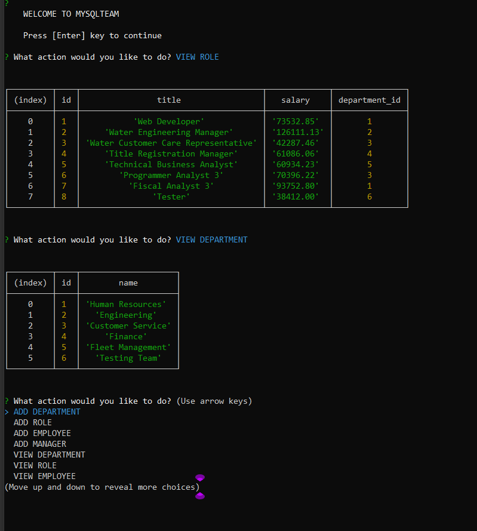

# MySQL Team

License: 

## Description 

This is a project to build and manage your employees and team using mySQL database to store the data. This program is a command line application.

video demonstration link - (https://drive.google.com/file/d/1rEEw5lQefleuPTUpz2PFEFTvmpZwF6vW/view) 

## Table of Contents

* [Installation](#installation)
* [Usage](#usage)
* [License](#license)
* [Contributing](#contributing)
* [Tests](#tests)
* [Questions](#questions)

## Installation

Instructions for installation of the project as follows: 
  - You will need to install the following NPM package
    - console.table for viewing the data in a table
    - dotenv to keep your server information private and safe
    - inquirer to insert prompts for user input
    - mySQL for connection to your mySQL server
  - run 'node index' in the console to begin the program

## Usage 

You will be presented with a welcome screen. Press [Enter] to begin and you will be presented with a list of options you can do with the program. 

  - ADD DEPARTMENT - prompt for department name to add to department table
  - ADD ROLE - prompt with list to select department the role will belong to, then prompts for the title and salary of the role
  - ADD EMPLOYEE - prompt with list to select role the employee will have; prompt user if this employee have a manager; if 'yes', list of manager to select for the employee; otherwise prompt for employee first name and last name
  - ADD MANAGER - prompts for first name and last name to add to manager table
  - VIEW DEPARTMENT - displays all the departments on the table
  - VIEW ROLE - displays all the roles on the table
  - VIEW EMPLOYEE - displays all the employees on the table
  - VIEW MANAGER - displays all the managers on the table
  - UPDATE EMPLOYEE ROLE - prompt with list of employee to select to edit and then what role to change the empployee to
  - EXIT THE PROGRAM - exits the program and land on your console

References:

https://www.opendataphilly.org/dataset/employee-salaries-overtime
https://github.com/SBoudrias/Inquirer.js/blob/master/packages/inquirer/examples/pizza.js#L56-L71

## License

MIT

## Contributing

You can fork a copy of the repo to install on your end and request for changes to the main repo. I will review the changes before they are updated to the main repo. 

## Tests

You can test the application by using the application on your device. Tests script may be provided in later releases. 

## Questions

If you have any questions, feel free to contact me and listed below are my contact informations. 

GitHub profile: code-monkey713

Email: codemonkey713@gmail.com

